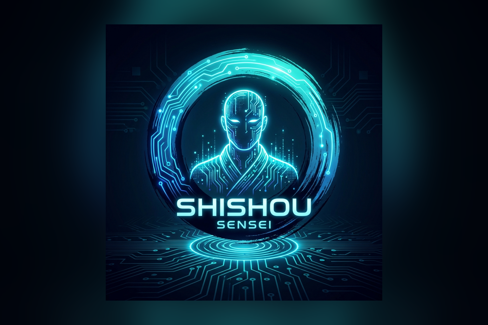
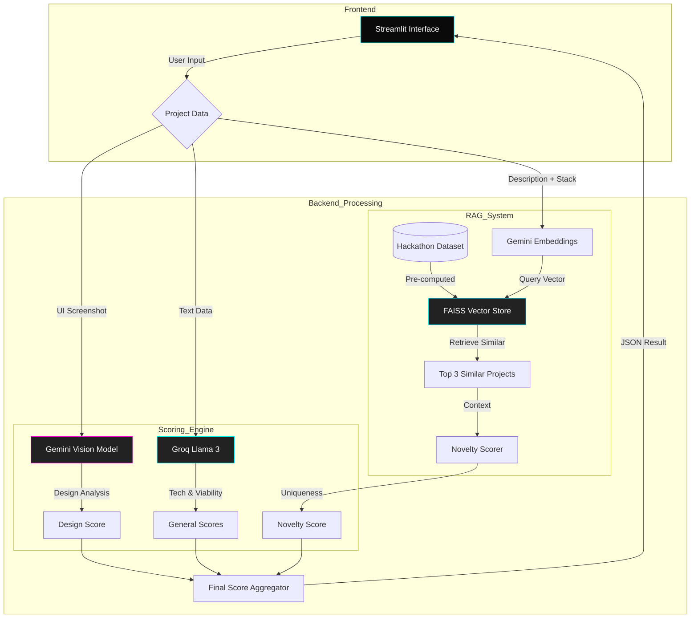

# 🤖 Shishou: AI Hackathon Judge



Shishou is an intelligent hackathon assistant that evaluates project ideas against thousands of past hackathon winners. It uses a multi-modal approach to score projects on **Novelty**, **Technical Complexity**, **Viability**, and **Design**.

## 💡 Inspiration
We've all been there: 2 AM at a hackathon, wondering, "Has this been done before?" or "Is this technical enough to win?" Judges are overwhelmed, and feedback is often scarce. We wanted to build **Shishou** (Japanese for "Sensei" or "Master")—an intelligent mentor that gives you instant, data-driven feedback on your project idea before you write a single line of code.

## 🧠 What it does
Shishou is a multi-modal AI judge. You feed it your project name, description, tech stack, and even a mock-up screenshot. It then:
1.  **Checks Novelty**: Searches a vector database of thousands of past hackathon winners to see if your idea is unique.
2.  **Audits Tech Stack**: uses Llama 3 (via Groq) to evaluate the complexity and viability of your proposed architecture.
3.  **Critiques Design**: Uses Gemini 1.5 Pro to "look" at your UI and score it on aesthetics and accessibility.
4.  **Scores You**: Generates a unified scorecard with actionable advice.

## ⚙️ How we built it
We built Shishou using a best-in-class AI stack:
*   **Orchestration**: LangChain to manage the flow between different agents.
*   **Reasoning Engine**: **Groq** powering **Llama 3.3 70B** for lightning-fast auditing.
*   **Vision & Embeddings**: **Google Gemini 1.5 Pro** for vision and **Gemini Text-Embedding-004** for our RAG system.
*   **Vector Database**: **FAISS** to store and retrieve similar projects from our dataset.
*   **Frontend**: **Streamlit**, heavily customized with raw CSS to achieve a "Glassmorphism" aesthetic that stands out.

## 🚧 Challenges we ran into
*   **Model Orchestration**: Coordinating between Groq (for speed) and Gemini (for vision) required careful prompt engineering and error handling in Python.
*   **Streamlit Limitations**: Breaking out of Streamlit's standard look to create a "Next.js-quality" UI required injecting custom CSS and hacking the layout components.
*   **Latency**: We wanted the feedback to be near-instant. Optimizing the RAG retrieval and switching to Groq for the text reasoning significantly cut down our wait times.

## 🏆 Accomplishments that we're proud of
*   **The "Judge's Eye"**: Successfully implementing a Vision model that can actually give meaningful design feedback on a UI screenshot.
*   **The Speed**: Leveraging Groq to make the text analysis feel instantaneous.
*   **The Aesthetic**: Building a Streamlit app that doesn't *look* like a Streamlit app.

## 📚 What we learned
We learned the immense value of **RAG (Retrieval-Augmented Generation)** for validation. Letting the AI "see" past winners made its advice much more grounded in reality rather than just generic encouragement. We also learned that **Groq's** speed is a game-changer for agentic workflows where multiple prompts are chained together.

## 🚀 What's next for Shishou
*   **Live Pitch Mode**: Analyze a video pitch using Gemini's video capabilities.
*   **Devpost Sync**: Automatically scrape the latest winners to keep the knowledge base current.
*   **Team Matchmaking**:Suggesting teammates based on the missing skills in your tech stack.

## ✨ Features

- **Novelty Scoring (RAG)**: Retrieves similar past winning projects using **FAISS** and **Gemini Embeddings** to determine how unique your idea is.
- **Design Analysis (Vision)**: Uses **Gemini 1.5 Pro** to critique UI screenshots for hierarchy, accessibility, and aesthetics.
- **Technical Audit (Reasoning)**: Uses **Llama 3 (via Groq)** to analyze the tech stack and implementation details, checking for advanced AI components (Agents, RAG, Fine-tuning).
- **Modern UI**: Built with **Streamlit** featuring a custom "Organic Glassmorphism" theme inspired by modern design trends.

## 🛠️ Tech Stack

- **Frontend**: Streamlit, Plotly
- **Backend**: Python, LangChain
- **AI Models**:
    - **Reasoning**: Llama 3.3 70B (Groq)
    - **Vision**: Llama 4 Scout (17B Multimodal via Groq)
    - **Embeddings**: `all-MiniLM-L6-v2` (Local HuggingFace) - Free & Unlimited.
- **Vector Database**: FAISS (Stores 10k+ projects locally)

## 🚀 Getting Started

### 1. Clone the Repository
```bash
git clone https://github.com/kkadapa/Shishou.git
cd Shishou
```

### 2. Install Dependencies
```bash
pip install -r requirements.txt
```

### 3. Setup Environment Variables
Create a `.env` file in the root directory:
```env
GROQ_API_KEY=your_groq_api_key
GEMINI_API_KEY=your_gemini_api_key
```

### 4. Build the Vector Index
Before running the app, you need to generate the embeddings index for the RAG engine.
```bash
python backend/build_index.py
```
*This may take a few minutes as it processes the hackathon dataset.*

### 5. Run the Application
```bash
streamlit run frontend/app.py
```

## 📂 Project Structure

```
hackalytics/
├── backend/
│   ├── build_index.py    # Script to generate FAISS index
│   ├── evaluator.py      # Main scoring logic (LLM + Vision)
│   ├── rag_engine.py     # RAG logic (Embeddings + Retrieval)
│   └── faiss_index/      # Generated vector store (gitignored)
├── frontend/
│   └── app.py            # Streamlit UI
├── data/
│   └── hackathon_data.csv
├── requirements.txt
└── README.md
```

## 🏗️ Architecture


## 📄 License
MIT
