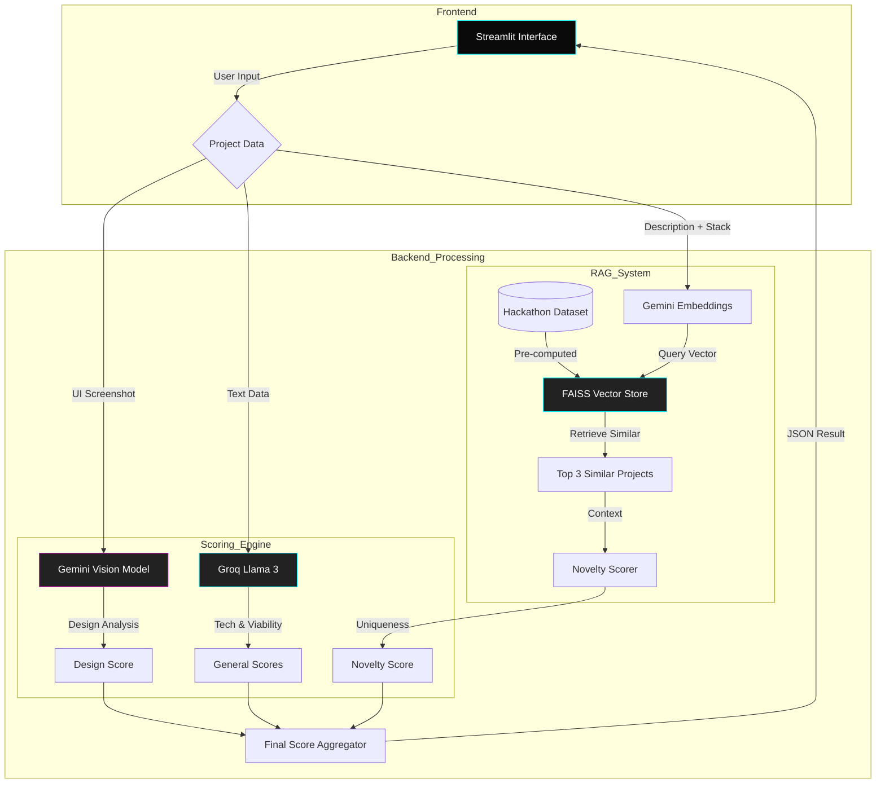

# 🏆 Hackalytics: AI Project Judge

Hackalytics is an intelligent hackathon assistant that evaluates project ideas against thousands of past hackathon winners. It uses a multi-modal approach to score projects on **Novelty**, **Technical Complexity**, **Viability**, and **Design**.

## ✨ Features

- **Novelty Scoring (RAG)**: Retrieves similar past winning projects using **FAISS** and **Gemini Embeddings** to determine how unique your idea is.
- **Design Analysis (Vision)**: Uses **Gemini 1.5 Pro** to critique UI screenshots for hierarchy, accessibility, and aesthetics.
- **Technical Audit (Reasoning)**: Uses **Llama 3 (via Groq)** to analyze the tech stack and implementation details, checking for advanced AI components (Agents, RAG, Fine-tuning).
- **Modern UI**: Built with **Streamlit** featuring a custom "Organic Glassmorphism" theme inspired by modern design trends.

## 🛠️ Tech Stack

- **Frontend**: Streamlit, Plotly
- **Backend**: Python, LangChain
- **AI Models**:
    - **Reasoning**: Llama 3.3 70B (Groq)
    - **Embeddings**: Text-Embedding-004 (Gemini)
    - **Vision**: Gemini 1.5 Pro (Google)
- **Vector Database**: FAISS

## 🚀 Getting Started

### 1. Clone the Repository
```bash
git clone https://github.com/yourusername/hackalytics.git
cd hackalytics
```

### 2. Install Dependencies
```bash
pip install -r requirements.txt
```

### 3. Setup Environment Variables
Create a `.env` file in the root directory:
```env
GROQ_API_KEY=your_groq_api_key
GEMINI_API_KEY=your_gemini_api_key
```

### 4. Build the Vector Index
Before running the app, you need to generate the embeddings index for the RAG engine.
```bash
python backend/build_index.py
```
*This may take a few minutes as it processes the hackathon dataset.*

### 5. Run the Application
```bash
streamlit run frontend/app.py
```

## 📂 Project Structure

```
hackalytics/
├── backend/
│   ├── build_index.py    # Script to generate FAISS index
│   ├── evaluator.py      # Main scoring logic (LLM + Vision)
│   ├── rag_engine.py     # RAG logic (Embeddings + Retrieval)
│   └── faiss_index/      # Generated vector store (gitignored)
├── frontend/
│   └── app.py            # Streamlit UI
├── data/
│   └── hackathon_data.csv
├── requirements.txt
└── README.md
```

## 🏗️ Architecture


## 📄 License
MIT
